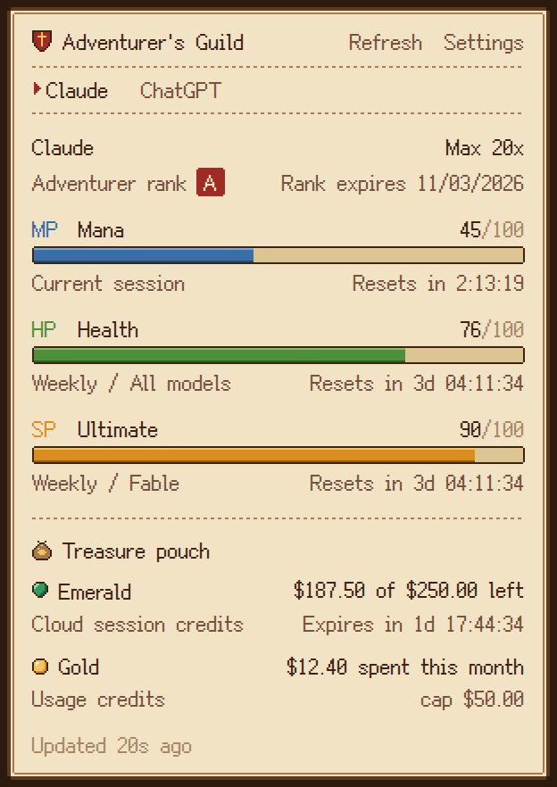
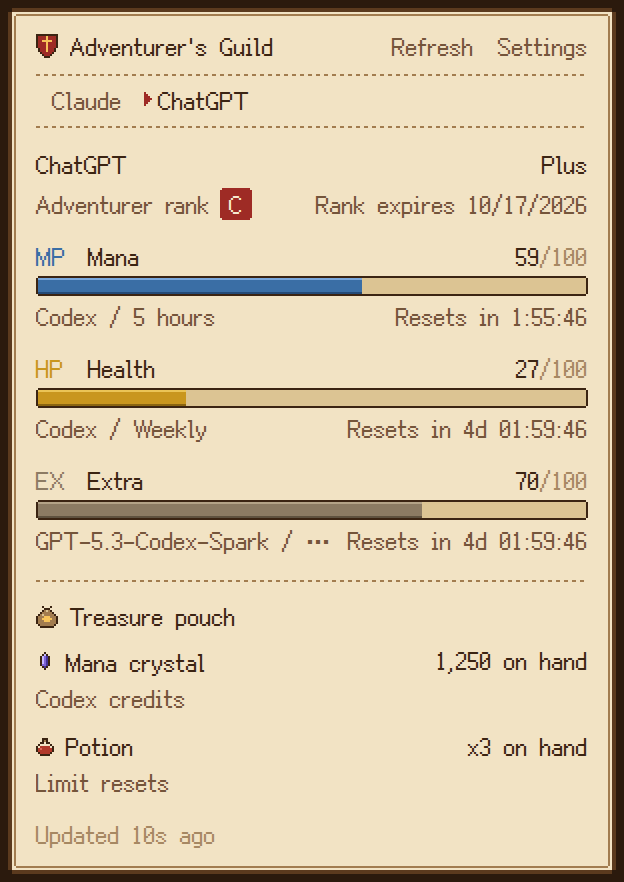
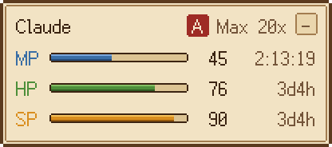
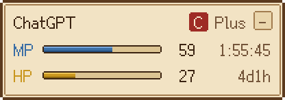
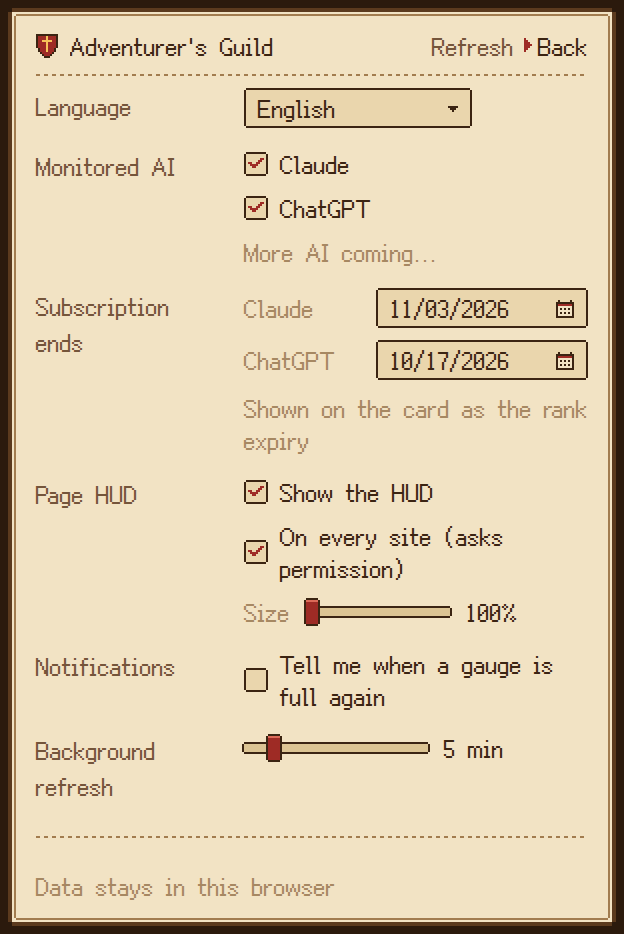
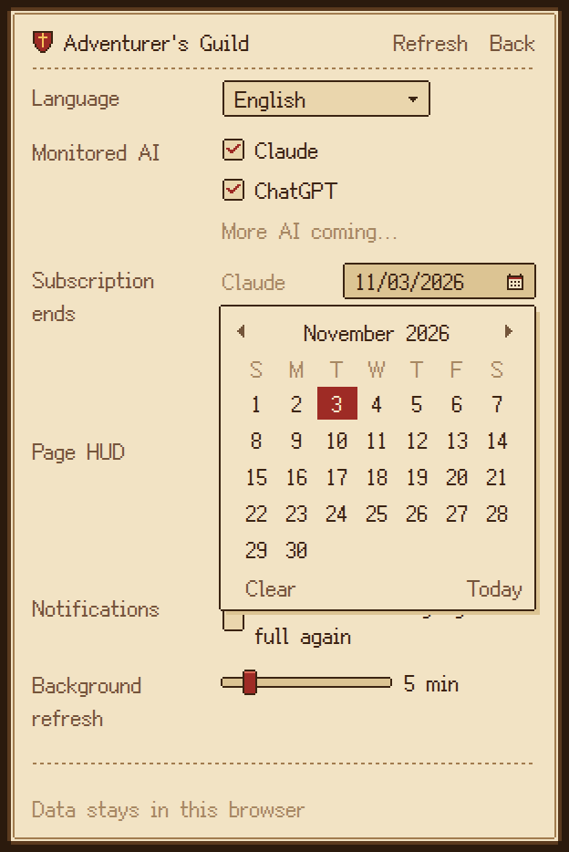

# Web AI Monitor - Adventurer's Guild

[简体中文](README.md) | English

A Chrome extension (Manifest V3) that shows how much of each AI's usage limits you have left, with live reset countdowns, as a pixel-art "adventurer's guild card" from an isekai fantasy world. It currently supports Claude and ChatGPT. Each vendor's limit plan template, data fetching and UI are decoupled: every vendor has its own set of gauges, treasures and rank ladder, and nothing from one vendor is forced onto another.

| Claude | ChatGPT |
| --- | --- |
|  |  |

| Page HUD (follows the vendor picked in the popup) | Settings (pixel calendar) |
| --- | --- |
| <br><br><br><br>Collapsed:   | <br><br> |

The UI is available in Simplified Chinese (default), Japanese and English. The screenshots above are the English UI; the [Chinese README](README.md) shows the Chinese one.

## Gauges (Claude)

| Gauge | RPG meaning | Claude limit | Notes |
| --- | --- | --- | --- |
| MP Mana | Blue bar | Current session (5-hour session) | Drains as you use it; refills when the session ends |
| HP Health | Green -> yellow -> red | Weekly / All models | Turns yellow below 50% left, red below 20% |
| SP Ultimate | Gold ultimate bar | Weekly / Fable | Full = no Fable used yet, flashes READY!; using Fable drains it, the weekly reset refills it |
| EX Extra | Greyish brown | Any new limit the template does not name | Popup only, so nothing is lost when Anthropic adds a limit |

- Every bar shows what is **left** (= 100 - the used% on claude.ai's settings page).
- Every bar has a live countdown: `2:13:45` under a day, `3d 04:12:09` beyond that (`3d4h` in the HUD).
- Before a session starts, MP shows "Standby". When a countdown runs out the bar shows "Recovering..." and refills, and the background fetches fresh numbers right away.
- On Pro or standard Team seats, which have no weekly Fable allowance, SP shows "Sealed".

## The ChatGPT scheme

Since August 2026 ChatGPT's text chat no longer has message caps; what actually runs out is the Codex allowance. So the ChatGPT card is a scheme of its own:

| Element | ChatGPT meaning | Notes |
| --- | --- | --- |
| MP Mana | Codex / 5-hour window | "Sealed" when the plan has no 5-hour window |
| HP Health | Codex / weekly window | Same colors as Claude |
| EX Extra | Per-model limits, the Code review limit, workspace credits | Popup only |
| Mana crystal | Codex credits (points, not money) | The balance on hand, or "Unlimited"; "Off" when there are none |
| Potion | Limit resets | A count such as x3 |

There is no ultimate gauge (SP), and no gold or emeralds: those belong to Claude's template. The rank ladder follows ChatGPT's personal plans: Pro = A, Pro Lite = B, Plus = C, Go = D, Free = E (Team / Business = B, Edu = C, Enterprise = S).

ChatGPT is not monitored by default. Only when you tick ChatGPT under "Monitored AI" in settings does the extension ask Chrome for access to chatgpt.com. Once you allow it, fetching starts; unticking it gives the permission back.

## Adventurer rank

Under the vendor's name the popup shows the "Adventurer rank" and when the rank expires (ChatGPT's ladder is in the previous section):

| Claude plan | Rank |
| --- | --- |
| Max 20x (top personal plan) | A |
| Max 5x | B |
| Pro | C |
| Free | D |
| Team / Enterprise (organization plans, not on the personal ladder) | B / S |

- The rule lives in the vendor template: `ladder` lists the personal plans from highest to lowest. The first is A, and each step down is one letter lower. For another vendor, list its personal plans the same way. Organization plans state their rank in the template directly.
- You pick the rank's expiry yourself under "Subscription ends" in settings, on a pixel calendar (one date per vendor: the day your subscription ends). Clear it from the calendar's footer, or with Delete. The rank is still valid on that day; after it, the card says "Rank expired on ...". It turns red within three days of the date and once it has passed.
- On a paid plan with no date set, the card shows "Rank expiry not set"; clicking it jumps straight to that vendor's date field in settings. Free plans show nothing when unset. The HUD puts the rank and its expiry in the seal's tooltip.

## Treasure pouch (credits)

Below the gauges, the popup has a "Treasure pouch". Each entry reads like a gauge: the top line is the treasure's name and amount, the line below is the real credit it stands for and its state. Which treasures go in the pouch is up to each vendor's template; the table is Claude's (ChatGPT's is above):

| Treasure | Real credit | Shown as |
| --- | --- | --- |
| Emerald | Cloud session credits (Claude Code cloud session credits, in US dollars) | Left / total, and a countdown to expiry; red below 20%; marked when expired, locked or used up |
| Gold | Usage credits (extra usage) | Spent this month, and the monthly cap or "no cap"; "Off" when not enabled, "Cap reached" at the cap |

An entry the account does not have is left out; when neither exists, the whole pouch is hidden. The HUD has no pouch, to stay small.

## Features

- **Popup**: the guild card (adventurer rank and its expiry), gauges with countdowns, the treasure pouch, "Updated Ns ago", and the settings page. When more than one vendor is monitored, vendor tabs (Claude / ChatGPT) appear at the top. The vendor you pick is saved in settings, and the page HUD and the toolbar icon switch with it.
- **Settings**: the language dropdown and the date picker are custom pixel controls (a small parchment window, pixel arrows and pointer) and work from the keyboard: arrow keys and Enter in the dropdown; in the calendar, arrow keys move the day, PageUp / PageDown change the month, Delete clears, Esc closes.
- **Page HUD**: by default it only appears on the sites of the vendors you monitor (claude.ai, plus chatgpt.com once that is on). It shows one vendor at a time: whichever vendor is picked in the popup, the HUD in every tab switches at once to that vendor's own panel (MP / HP / SP for Claude, only MP / HP for ChatGPT, and the same for the collapsed tab). Ticking "On every site (asks permission)" in settings is the only time the extension asks Chrome for access to all sites; once allowed, the HUD appears in the tabs already open, and unticking it gives the permission back. Its size is a slider in settings (100% - 200%; the pixels are sharpest at 100% and 200%). Drag it anywhere and it snaps to the nearest corner when released; collapse it into a 30x22 tab; it hides in full screen. It lives in a closed shadow DOM, so page styles do not touch it, and the pixel font works even on sites with a strict CSP.
- **Monitored AI**: every supported vendor has a switch in settings (Claude on by default; ChatGPT off by default, and ticking it asks for chatgpt.com). A vendor switched off is no longer fetched, and the popup, HUD and toolbar icon stop showing it. The toolbar icon also shows the vendor picked in the popup; if that vendor is switched off, the popup, HUD and toolbar all fall back to the first vendor still monitored.
- **Recovery notification** (off by default): ticking "Tell me when a gauge is full again" is when the notification permission is requested. When a used MP / HP / SP refills at its reset time, you get one desktop notification (once per window; notices missed by more than an hour while the browser was closed are dropped). Clicking it opens claude.ai.
- **Toolbar icon**: the icon itself is the current vendor's mini gauges (three bars for Claude; ChatGPT has no SP, so two), live. There is no badge normally: it only shows the number left when MP is below 20%, and the time until MP returns (such as `45m`) once MP is empty. The tooltip has the full numbers and reset times.
- **When it refreshes**:
  - on a timer in the background (5 minutes by default; any value from 1 to 30 minutes with the slider in settings, by dragging, the mouse wheel or the arrow keys);
  - about a second after each reply (or Codex task) finishes on claude.ai / chatgpt.com;
  - when any window reaches its reset time;
  - when you open the popup or come back to a tab (if the numbers are old);
  - only every 30 minutes while you are signed out.
- **Languages**: Simplified Chinese (default) / Japanese / English. It follows the browser unless you pick one in settings.

## Install (developer mode)

1. Clone this repository.
2. Open `chrome://extensions` and turn on "Developer mode" (top right).
3. Click "Load unpacked" and pick the repository's `extension/` folder.
4. Make sure you are signed in to [claude.ai](https://claude.ai) in Chrome.
5. claude.ai tabs that were open before the install need one reload before the HUD shows up. To show it on every site, tick "On every site" in the popup's settings.

There is no build step: `extension/` is everything Chrome loads.

## Where the data comes from, and where it stays

- It reads the endpoints claude.ai's own web app uses (not a public API; they may change at any time):
  - `GET https://claude.ai/api/organizations`: finds the current organization (the `lastActiveOrg` cookie first) and infers the plan;
  - `GET https://claude.ai/api/organizations/{org}/usage`: the usage. Both the new `limits[]` format (`session` / `weekly_all` / `weekly_scoped` + `scope.model.display_name`) and the old `five_hour` / `seven_day` / `seven_day_*` keys are parsed; unknown fields are skipped. The treasure pouch comes from the same response: `extra_usage` (amounts in minor currency units, converted with `decimal_places`) and the cloud session credits (currently the code-named field `iguana_necktie`, in US dollars, where `resets_at` is the expiry; if the code name changes, it falls back to the keywords `cloud` / `ccr` / `remote_session`).
- It reads the endpoints chatgpt.com's own web app uses (also not public):
  - `GET https://chatgpt.com/api/auth/session`: the access token, account id and plan (`accessToken`, `account.id`, `account.planType`; the token is only kept in memory for the next request and never stored). When this goes through a tab, the page hands back only those three; `sessionToken`, the email, the name and every other field stay in the page. Newer pages reportedly no longer return a token here; the next request is then sent with cookies only;
  - `GET https://chatgpt.com/backend-api/wham/usage` (with `Authorization` and `ChatGPT-Account-Id`): `rate_limit.primary_window` / `secondary_window` (`used_percent`, `limit_window_seconds`, `reset_at` as epoch seconds), `additional_rate_limits[]`, `code_review_rate_limit`, `spend_control.individual_limit`, `credits` (`balance` is a string), `rate_limit_reset_credits.available_count`, `plan_type`.
- The background service worker asks directly first. If that is blocked (for example, it gets a challenge page), it borrows an open tab of that vendor and asks same-origin as the page (each vendor allows only the paths listed above, read-only GET; ChatGPT allows only the two request headers above to be passed on).
- Data is only kept locally in `chrome.storage.local` and is never sent to any third-party server.

### Permissions

At install it only asks for the permissions in the first table, so Chrome's install prompt only says "Read and change your data on claude.ai".

| Asked at install | What for |
| --- | --- |
| `host_permissions: https://claude.ai/*` | Reading the usage endpoints in the background; showing the HUD on claude.ai and noticing when a reply finishes, to refresh right away |
| `storage` | Keeping usage snapshots and settings |
| `alarms` | Timed refreshes, and refreshing at reset times |
| `cookies` | Reading claude.ai's `lastActiveOrg`, to follow the organization you switch to on the site |
| `scripting` | Once every site is allowed, registering the HUD script and adding it to open tabs |

| Asked when needed (optional) | When |
| --- | --- |
| `optional_host_permissions: http(s)://*/*` | When you tick "On every site"; unticking gives it back |
| `optional_host_permissions: https://chatgpt.com/*` | When you tick ChatGPT under "Monitored AI"; unticking gives it back |
| `optional_permissions: notifications` | When you tick "Tell me when a gauge is full again"; unticking gives it back |

If you revoke any of these yourself in `chrome://extensions`, the matching setting switches off too.

## Architecture: decoupled vendors

```
extension/
  providers/                  one folder per vendor; the only place that knows vendor details
    index.js                  vendor registry
    claude/provider.js        fetch + normalize: vendor API -> Meter[] (id, kind, scope, used, resetsAt)
    claude/template.js        limit plan template (data only): which limit plays which role, which credit is
                              which treasure, plan -> rank, vendor-specific text
    chatgpt/provider.js       ChatGPT: /api/auth/session + /backend-api/wham/usage -> Meter[] + Wallet[]
    chatgpt/template.js       ChatGPT's own scheme: MP / HP + EX, mana crystals / potions, a ladder from Pro
  core/                       vendor-agnostic
    gauges.js                 Meter[] + template -> each card row (left, level, READY, sealed, recovering)
    wallets.js                Wallet[] + template -> each pouch row (balance, cap, expiry, state)
    rank.js                   plan + template ladder -> adventurer rank; the date you pick -> rank expiry
    roles.js                  the role vocabulary: mp / hp / sp / ex; treasures: coin / emerald / crystal / potion
    i18n.js, messages.js      languages
    time.js                   countdowns and time formats
    settings.js, store.js     settings and snapshots (chrome.storage.local)
    http.js                   the minimal HTTP interface a provider sees
  ui/                         theme and components (shared by the popup and the HUD)
    theme.css                 the guild card pixel theme
    card.js                   vendor card / gauge components
    pixel-icon.js             the toolbar icon's pixel art
  background/                 the only writer of data: polling, reset alarms, the tab proxy, the toolbar icon,
                              recovery notifications (notify.js), all-sites permission and script registration (page-hud.js)
  content/                    the HUD + vendor page hooks (reply finished, proxied requests)
  popup/                      the popup
```

Data flow:

```
vendor API --provider.fetchUsage()--> Meter[] + Wallet[] --written by background--> chrome.storage.local
                                                                                      |
                        popup / the HUD on each page <------- listen for changes -----+
                        buildGaugeViews(vendor template, Meter[])   -> MP / HP / SP gauges
                        buildWalletViews(vendor template, Wallet[]) -> treasure pouch
```

Each layer has one job:

- **provider** only knows how to get the data and turn it into uniform Meters; it does not know MP/HP/SP exist;
- **template** only describes, as data, which limits the vendor's plans have and which role each plays; it contains no logic;
- **theme/components** only know roles, never vendors.

### Adding a vendor

1. Create `extension/providers/<id>/template.js`, for example:

   ```js
   export default {
     gauges: [
       { key: 'short', role: 'mp', match: { kind: 'three_hour' }, label: { key: 'acme.short' } },
       { key: 'weekly', role: 'hp', match: { kind: 'weekly', scope: null }, label: { key: 'meter.weeklyAll' } },
       { key: 'pro', role: 'sp', match: { kind: 'weekly', scope: 'pro-model' }, label: { key: 'acme.pro' }, optional: true },
     ],
     wallets: [{ key: 'credits', treasure: 'coin', match: { id: 'prepaid' }, label: { key: 'acme.credits' } }], // optional
     ladder: ['pro', 'plus', 'free'],   // personal plans, highest first: pro = A, plus = B, free = C
     plans: { pro: { name: 'Pro' }, plus: { name: 'Plus' }, free: { name: 'Free' }, business: { name: 'Business', rank: 'S' } },
     messages: {
       zh_CN: { 'acme.short': '3 小时窗口', 'acme.pro': '每周 / Pro 模型', 'acme.credits': '预付额度' },
       ja: { 'acme.short': '3 時間枠', 'acme.pro': '週間 / Pro モデル', 'acme.credits': 'プリペイド' },
       en: { 'acme.short': '3-hour window', 'acme.pro': 'Weekly / Pro model', 'acme.credits': 'Prepaid credits' },
     },
   };
   ```

2. Create `extension/providers/<id>/provider.js` exporting `{ id, name, site, origin, homeUrl, template, proxyPaths, proxyHeaders?, proxyBody?, isActivity(path, ms), fetchUsage(http) }`, where `fetchUsage(http)` returns `{ meters, wallets, plan }` (`wallets` may be an empty array). For extra request headers (a Bearer token, say), use `http.getJson(path, { headers })` and list the headers that may pass through a tab in `proxyHeaders`. If a response carries sensitive fields you do not need, use `proxyBody(path, body)` so the tab hands back only what you need.
3. Register it in `extension/providers/index.js`. Pick one way to get its site:
   - always on: add the domain to `host_permissions` and `content_scripts.matches` in `manifest.json`;
   - on request (recommended; ChatGPT works this way): set `enabledByDefault: false, optionalPermission: true` on the provider and add the domain to `optional_host_permissions`. Ticking it makes the popup ask for the permission, and the background registers the site's page script by itself.
4. Templates may only use the treasures in `TREASURES` in `core/roles.js` (coin / emerald / crystal / potion). For a new treasure, register it there and draw its pixel art in `TREASURE_ART` in `ui/dom.js`.
5. If the template brings new UI text, run `npm run build:font` to rebuild the font subset.

## Development

Needs Node 22+.

```sh
npm test                 # unit tests: parsing, template mapping, pouch, rank, recovery, countdowns, languages, settings, icon
npm run build:icons      # generates the 16/32/48/128 icons from ui/pixel-icon.js
npm run build:font       # rebuilds the pixel font subset when UI text changes (needs pip install fonttools brotli)
npm run preview          # loads the extension with Playwright against a mocked claude.ai, runs end-to-end checks,
                         # and saves screenshots to preview-out/
```

`npm run preview` needs `npm install` and `npx playwright install chromium` first. It loads two copies of the extension in turn, the one as shipped (no optional permissions) and one with the optional permissions granted, and checks that:

- by default the HUD appears on claude.ai only, not on other sites, and no script is registered;
- when the direct background request is blocked, data comes through a claude.ai tab, with both pouch entries parsed correctly;
- the gauges refresh after a reply finishes;
- once allowed, the HUD and the pixel font appear on other sites (including one with a strict CSP), and hide again when "On every site" is turned off;
- a used gauge that resets sends one, and only one, "fully restored" notification;
- rank expiry: when unset, its hint opens the pixel calendar in settings; a picked date is saved and shown, and can be cleared from the calendar's footer;
- the pixel dropdown: arrow keys to choose, Enter to save, a click outside to close;
- ChatGPT: once ticked, data comes through a chatgpt.com tab with the token, and its card only has MP / HP / EX, mana crystals and potions, with no ultimate, gold or emeralds;
- picking a vendor tab in the popup switches the HUD on chatgpt.com and on ordinary pages, and the toolbar tooltip, to that vendor (the ChatGPT panel has no SP, collapsed or not), and picking Claude switches them all back;
- the popup and its settings stay inside the card in Chinese, Japanese and English, with dates set and the calendar open;
- the refresh interval slider (mouse wheel, arrow keys) goes from 1 to 30 minutes and the timer follows; the HUD at 200% is exactly twice the size;
- switching Claude off shows a hint in the popup and hides the HUD, and switching it back on restores both.

## Font

The UI font is [Fusion Pixel Font](https://github.com/TakWolf/fusion-pixel-font) (the 12px proportional variant, which includes glyphs from Ark Pixel Font), under the SIL Open Font License 1.1. The repository only keeps the ~380 glyphs the UI uses (about 12 KB), renamed `WAM Guild Pixel`; the license is in `extension/assets/fonts/`.
