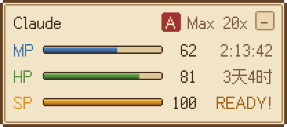
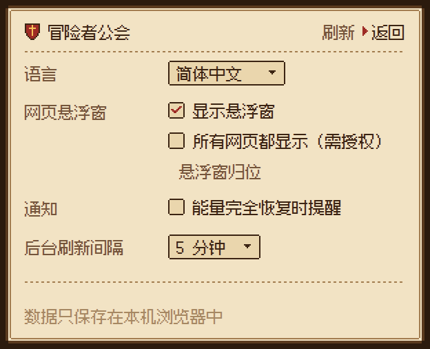

# Web AI Monitor - 冒险者公会

一个 Chrome 扩展（Manifest V3）：用像素风的「异世界冒险者公会卡」实时显示各家 AI 的用量和恢复倒计时。目前接入 Claude，厂商的「限制计划模板」与取数逻辑、界面三者解耦，后续可以直接加别家。

| 弹窗 | 页内悬浮窗 |
| --- | --- |
|  | <br><br>收起后：<br><br>设置：<br> |

## 能量条对应关系（Claude）

| 条 | RPG 含义 | Claude 的限制 | 说明 |
| --- | --- | --- | --- |
| MP 魔力 | 蓝条 | Current session（5 小时会话） | 用得越多掉得越多，会话结束回满 |
| HP 体力 | 绿 -> 黄 -> 红 | Weekly / All models（每周全部模型） | 剩余 < 50% 变黄，< 20% 变红 |
| SP 奥义 | 金色大招条 | Weekly / Fable（每周 Fable） | 满格 = Fable 一点没用，闪光显示 READY!；用 Fable 会消耗，重置回满 |
| EX 额外 | 灰褐色 | 模板里没写到的新限制 | 只在弹窗里显示，保证 Anthropic 新增限制时不丢信息 |

- 所有条都显示 **剩余量**（= 100 - claude.ai 设置页上的 used%）。
- 每条都有实时倒计时：不到 1 天显示 `2:13:45`，超过 1 天显示 `3天 04:12:09`（悬浮窗里是 `3天4时`）。
- 会话没开始时 MP 显示「待机中」；倒计时走完会先显示「恢复中...」并把条回满，后台随即重新拉取。
- Pro / 标准 Team 席位没有 Fable 周额度时，SP 显示为「封印中」。

## 金币袋（额度）

弹窗里能量条下方是「金币袋」，分两行：

| 行 | 来源 | 显示 |
| --- | --- | --- |
| 云端会话额度 | Claude Code 云端会话的赠送额度（美元） | 剩余 / 总额，失效倒计时；不足 20% 变红；失效、锁定、用完时注明 |
| 用量额度 | 用量额度（Usage credits / extra usage） | 本月已用，以及月度上限或「无上限」；未开启显示「未启用」，花到上限显示「已达上限」 |

账户没有某一项时，那一行不显示；两项都没有时整个金币袋不显示。悬浮窗里不显示金币袋，保持简洁。

## 功能一览

- **弹窗**：公会卡（等级印章 = 方案，Max 20x 是 A 级），三条能量 + 倒计时 + 金币袋 + 「x 秒前更新」，以及设置页。
- **页内悬浮窗**：默认只在 claude.ai 上显示；在设置里勾选「所有网页都显示（需授权）」时才向 Chrome 申请所有网站的权限，同意后立刻出现在已打开的标签页里，取消勾选会把权限交还。可拖动，松手吸附到最近的角落；可收起成 30x22 的小标签；可按网站隐藏；全屏时自动隐藏；放在 closed shadow DOM 里，不受网页样式影响，严格 CSP 的网站也能正常显示像素字体。
- **恢复通知**（默认关）：勾选「能量完全恢复时提醒」时才申请通知权限。用过的 MP / HP / SP 在重置时刻回满后，发一条桌面通知（每个窗口只发一次；浏览器关着时错过超过 1 小时的不再补发）；点通知打开 claude.ai。
- **工具栏图标**：图标本身就是三条迷你能量条，实时反映剩余量；平时不显示徽章，只有 MP < 20% 时显示剩余数字，MP 耗尽时显示恢复倒计时（如 `45m`）。鼠标悬停有完整数字和恢复时刻。
- **刷新时机**：
  - 后台定时（默认 5 分钟，可选 1 / 3 / 5 / 10 / 15 / 30）；
  - 在 claude.ai 上每次回复结束约 1 秒后；
  - 任一窗口到达重置时刻时；
  - 打开弹窗、切回标签页（数据较旧时）；
  - 未登录时自动降频到 30 分钟一次。
- **多语言**：简体中文（默认）/ 日本語 / English，默认跟随浏览器，可在设置里切换。

## 安装（开发者模式）

1. 克隆本仓库。
2. 打开 `chrome://extensions`，打开右上角「开发者模式」。
3. 点「加载已解压的扩展程序」，选择仓库里的 `extension/` 目录。
4. 确保已在 Chrome 里登录 [claude.ai](https://claude.ai)。
5. 安装前已打开的 claude.ai 标签页需要刷新一次才会出现悬浮窗。想在所有网页上显示，到弹窗的设置里勾选「所有网页都显示」。

不需要构建步骤，`extension/` 就是 Chrome 加载的全部内容。

## 数据从哪里来，存在哪里

- 读取 claude.ai 网页自己用的接口（非公开 API，可能随时变动）：
  - `GET https://claude.ai/api/organizations`：找到当前组织（优先 `lastActiveOrg` cookie）并推断方案；
  - `GET https://claude.ai/api/organizations/{org}/usage`：用量。新格式 `limits[]`（`session` / `weekly_all` / `weekly_scoped` + `scope.model.display_name`）和旧格式 `five_hour` / `seven_day` / `seven_day_*` 都能解析，不认识的字段会被跳过。金币袋来自同一个响应：`extra_usage`（金额以最小货币单位给出，按 `decimal_places` 换算）和云端会话额度（目前是代号字段 `iguana_necktie`，以美元给出，`resets_at` 是失效时间；代号改名时会按 `cloud` / `ccr` / `remote_session` 关键字兜底）。
- 后台 service worker 先直接请求；如果被拦（比如返回了验证页），会借用一个已打开的 claude.ai 标签页，以页面身份同源请求（只允许上面两个路径，只读 GET）。
- 数据只保存在本机的 `chrome.storage.local`，不发送到任何第三方服务器。

### 权限说明

安装时只申请第一张表里的权限，Chrome 的安装提示只有「读取和更改你在 claude.ai 上的数据」。

| 安装时申请 | 用途 |
| --- | --- |
| `host_permissions: https://claude.ai/*` | 后台读取用量接口；在 claude.ai 上显示悬浮窗并监听「回复结束」以便立即刷新 |
| `storage` | 保存用量快照和设置 |
| `alarms` | 定时刷新、在重置时刻刷新 |
| `cookies` | 读取 claude.ai 的 `lastActiveOrg`，跟随你在网页上切换的组织 |
| `activeTab` | 弹窗里的「在当前网站隐藏」需要知道当前标签页的域名 |
| `scripting` | 获得所有网站权限后，注册悬浮窗脚本并放进已打开的标签页 |

| 按需申请（可选权限） | 什么时候申请 |
| --- | --- |
| `optional_host_permissions: http(s)://*/*` | 勾选「所有网页都显示」时；取消勾选会交还 |
| `optional_permissions: notifications` | 勾选「能量完全恢复时提醒」时；取消勾选会交还 |

在 `chrome://extensions` 里手动撤销这些权限时，对应的设置也会自动关掉。

## 架构：厂商解耦

```
extension/
  providers/                  每个厂商一个目录，只有这里知道厂商细节
    index.js                  厂商注册表
    claude/provider.js        取数 + 归一化：厂商 API -> Meter[]（id, kind, scope, used, resetsAt）
    claude/template.js        限制计划模板（纯数据）：哪个限制扮演哪个角色、方案 -> 等级、厂商专用文案
  core/                       与厂商无关
    gauges.js                 Meter[] + 模板 -> 卡片上的每一行（剩余量、等级、READY、封印、恢复中）
    wallets.js                Wallet[] + 模板 -> 金币袋的每一行（余额、上限、失效、状态）
    roles.js                  角色词表：mp / hp / sp / ex
    i18n.js, messages.js      多语言
    time.js                   倒计时与时间格式
    settings.js, store.js     设置与快照（chrome.storage.local）
    http.js                   provider 看到的最小 HTTP 接口
  ui/                         主题与组件（弹窗和悬浮窗共用）
    theme.css                 公会卡像素主题
    card.js                   厂商卡片 / 能量条组件
    pixel-icon.js             工具栏图标的像素画
  background/                 唯一的数据写入者：轮询、重置闹钟、标签页代理、工具栏图标、
                              恢复通知（notify.js）、所有网站权限与脚本注册（page-hud.js）
  content/                    悬浮窗 + 厂商页面钩子（回复结束、代理请求）
  popup/                      弹窗
```

数据流：

```
厂商 API --provider.fetchUsage()--> Meter[] + Wallet[] --background 写入--> chrome.storage.local
                                                                          |
                         popup / 各网页的悬浮窗 <---------- 监听变化 ---------+
                         buildGaugeViews(厂商模板, Meter[])   -> MP / HP / SP 能量条
                         buildWalletViews(厂商模板, Wallet[]) -> 金币袋
```

三层各管一件事：

- **provider** 只负责「怎么拿到数据、怎么变成统一的 Meter」，不知道 MP/HP/SP 的存在；
- **template** 只用数据描述「这家厂商的方案有哪些限制，各扮演哪个角色」，不写任何逻辑；
- **主题/组件** 只认识角色，不认识厂商。

### 新增一个厂商

1. 新建 `extension/providers/<id>/template.js`，例如：

   ```js
   export default {
     gauges: [
       { key: 'short', role: 'mp', match: { kind: 'three_hour' }, label: { key: 'acme.short' } },
       { key: 'weekly', role: 'hp', match: { kind: 'weekly', scope: null }, label: { key: 'meter.weeklyAll' } },
       { key: 'pro', role: 'sp', match: { kind: 'weekly', scope: 'pro-model' }, label: { key: 'acme.pro' }, optional: true },
     ],
     wallets: [{ key: 'credits', match: { id: 'prepaid' }, label: { key: 'acme.credits' } }], // 可选
     plans: { plus: { name: 'Plus', rank: 'C' }, pro: { name: 'Pro', rank: 'A' } },
     messages: {
       zh_CN: { 'acme.short': '3 小时窗口', 'acme.pro': '每周 / Pro 模型', 'acme.credits': '预付额度' },
       ja: { 'acme.short': '3 時間枠', 'acme.pro': '週間 / Pro モデル', 'acme.credits': 'プリペイド' },
       en: { 'acme.short': '3-hour window', 'acme.pro': 'Weekly / Pro model', 'acme.credits': 'Prepaid credits' },
     },
   };
   ```

2. 新建 `extension/providers/<id>/provider.js`，导出 `{ id, name, site, origin, homeUrl, template, proxyPaths, isActivity(path, ms), fetchUsage(http) }`，其中 `fetchUsage` 返回 `{ meters, wallets, plan }`（`wallets` 可以是空数组）。
3. 在 `extension/providers/index.js` 里注册，在 `manifest.json` 的 `host_permissions` 和 `content_scripts.matches` 里加上它的域名。
4. 如果模板里出现了新的界面文字，运行 `npm run build:font` 重新生成字体子集。

## 开发

需要 Node 22+。

```sh
npm test                 # 单元测试：解析、模板映射、金币袋、恢复判定、倒计时、多语言、设置
npm run build:icons      # 由 ui/pixel-icon.js 生成 16/32/48/128 图标
npm run build:font       # 界面文字有变动时重新生成像素字体子集（需要 pip install fonttools brotli）
npm run preview          # 用 Playwright 加载扩展、模拟 claude.ai，跑端到端检查并截图到 preview-out/
```

`npm run preview` 需要先 `npm install` 和 `npx playwright install chromium`。它会依次加载两份扩展：原样的（没有任何可选权限）和一份把可选权限设为已授予的副本，检查：

- 默认只在 claude.ai 上出现悬浮窗，其他网站没有，也没有注册任何脚本；
- 后台直连被拦时能通过 claude.ai 标签页取数，金币袋的两行都解析正确；
- 回复结束后自动刷新；
- 授权后其他网站（包括严格 CSP 的）出现悬浮窗和像素字体，关掉「所有网页」后隐藏；
- 用过的能量重置后发且只发一次「完全恢复」通知。

## 字体

界面字体是 [Fusion Pixel Font](https://github.com/TakWolf/fusion-pixel-font)（缝合像素字体，12px 比例宽度版，含方舟像素字体的字形），SIL Open Font License 1.1。仓库里只放了界面用到的约 350 个字形（约 11 KB），重命名为 `WAM Guild Pixel`；授权文件在 `extension/assets/fonts/`。
