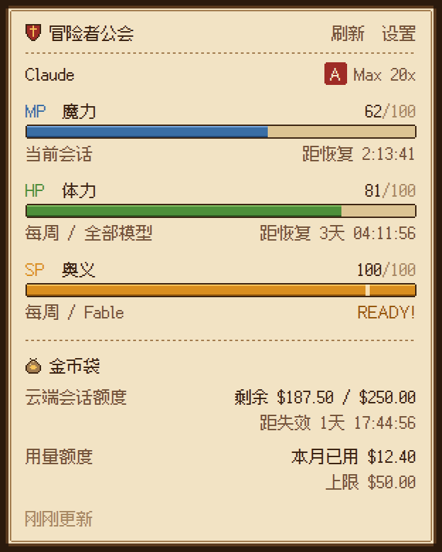
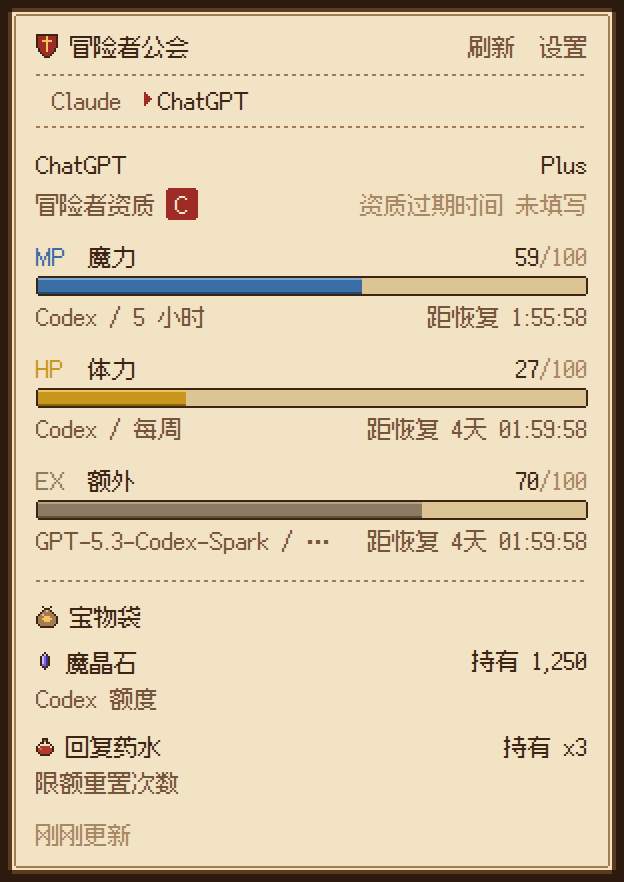
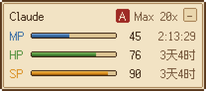
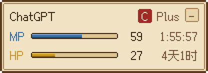
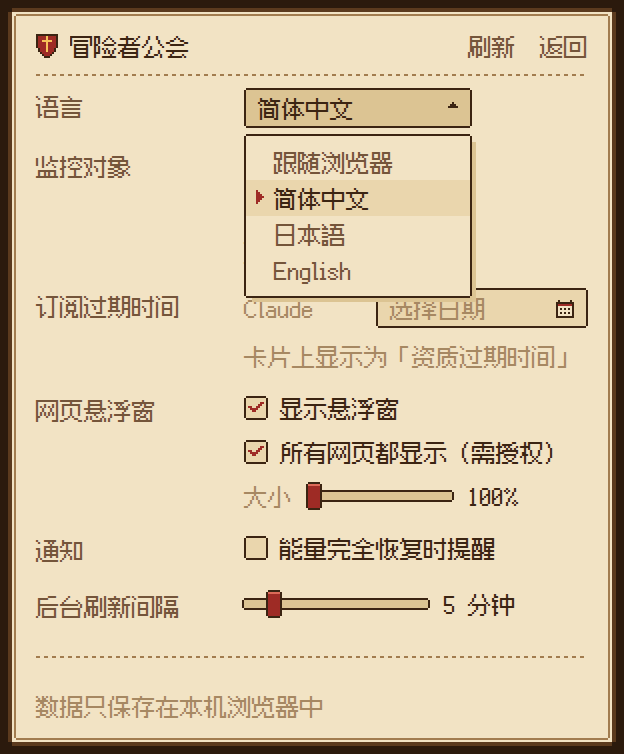
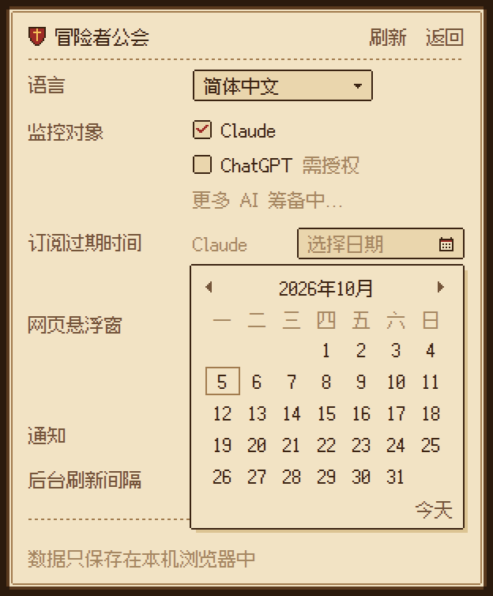

# Web AI Monitor - 冒险者公会

简体中文 | [English](README.en.md)

一个 Chrome 扩展（Manifest V3）：用像素风的「异世界冒险者公会卡」实时显示各家 AI 的用量和恢复倒计时。目前接入 Claude 和 ChatGPT。每家厂商的「限制计划模板」、取数逻辑和界面三者解耦：每家有自己的一套能量条、宝物和资质阶梯，不会把一家的元素硬套到另一家。

| Claude | ChatGPT |
| --- | --- |
|  |  |

| 页内悬浮窗（跟随弹窗里选中的厂商） | 设置（像素下拉框 / 日历） |
| --- | --- |
| <br><br><br><br>收起后：  | <br><br> |

## 能量条对应关系（Claude）

| 条 | RPG 含义 | Claude 的限制 | 说明 |
| --- | --- | --- | --- |
| MP 魔力 | 蓝条 | Current session（5 小时会话） | 用得越多掉得越多，会话结束回满 |
| HP 体力 | 绿 -> 黄 -> 红 | Weekly / All models（每周全部模型） | 剩余 < 50% 变黄，< 20% 变红 |
| SP 奥义 | 金色大招条 | Weekly / Fable（每周 Fable） | 满格 = Fable 一点没用，闪光显示 READY!；用 Fable 会消耗，重置回满 |
| EX 额外 | 灰褐色 | 模板里没写到的新限制 | 只在弹窗里显示，保证 Anthropic 新增限制时不丢信息 |

- 所有条都显示 **剩余量**（= 100 - claude.ai 设置页上的 used%）。
- 每条都有实时倒计时：不到 1 天显示 `2:13:45`，超过 1 天显示 `3天 04:12:09`（悬浮窗里是 `3天4时`）。
- 会话没开始时 MP 显示「待机中」；倒计时走完会先显示「恢复中...」并把条回满，后台随即重新拉取。
- Pro / 标准 Team 席位没有 Fable 周额度时，SP 显示为「封印中」。

## ChatGPT 的方案

ChatGPT 的文字聊天自 2026 年 8 月起不再限条数，真正会用完的是 Codex 的额度，所以 ChatGPT 卡片是独立的一套：

| 元素 | ChatGPT 对应 | 说明 |
| --- | --- | --- |
| MP 魔力 | Codex / 5 小时窗口 | 方案没有 5 小时窗口时显示「封印中」 |
| HP 体力 | Codex / 每周窗口 | 颜色规则同 Claude |
| EX 额外 | 各模型的单独限额、Code review 限额、工作区额度 | 只在弹窗里显示 |
| 魔晶石 | Codex 额度（credits，按点数，不是钱） | 持有量，或「无限」；没有额度时显示「未启用」 |
| 回复药水 | 限额重置次数 | 持有 x3 这样的个数 |

没有大招条（SP），也没有金币和绿宝石；这些只属于 Claude 的模板。资质阶梯按 ChatGPT 的个人方案：Pro = A，Pro Lite = B，Plus = C，Go = D，Free = E（Team / Business = B，Edu = C，Enterprise = S）。

ChatGPT 默认不监控：在设置的「监控对象」里勾选 ChatGPT 时，才向 Chrome 申请 chatgpt.com 的权限；同意后开始取数，取消勾选会交还权限。

## 冒险者资质

弹窗里名字下方显示「冒险者资质」和「资质过期时间」（ChatGPT 的阶梯见上一节）：

| Claude 方案 | 资质 |
| --- | --- |
| Max 20x（个人方案最高档） | A |
| Max 5x | B |
| Pro | C |
| Free | D |
| Team / Enterprise（组织方案，不在个人阶梯上） | B / S |

- 规则写在厂商模板里：`ladder` 按个人方案从高到低排列，第一档是 A，每低一档降一个字母；接别家时照样列出它的个人方案即可。组织方案在模板里单独写明资质。
- 资质过期时间由你在设置的「订阅过期时间」里用像素日历选择（每个厂商一个日期，填订阅的到期日；在日历底部点「清除」或按 Delete 可清除）。填写的那天当天仍有效，过了这天显示「资质已于 ... 过期」。三天内到期或已过期时变红。
- 付费方案没填时显示「资质过期时间 未填写」，点它直接跳到设置里对应的日期框；Free 方案没填时不显示。悬浮窗里把资质和过期时间放在印章的悬停提示里。

## 宝物袋（额度）

弹窗里能量条下方是「宝物袋」。每种额度写法和能量条一样：上一行是宝物名和数额，下一行是它实际对应的额度和状态。装什么宝物由各家模板决定，下表是 Claude 的（ChatGPT 的见上文）：

| 宝物 | 实际额度 | 显示 |
| --- | --- | --- |
| 绿宝石 | 云端会话额度（Claude Code cloud session credits，美元） | 剩余 / 总额，失效倒计时；不足 20% 变红；失效、锁定、用完时注明 |
| 金币 | 用量额度（Usage credits / extra usage） | 本月已用，以及月度上限或「无上限」；未开启显示「未启用」，花到上限显示「已达上限」 |

账户没有某一项时，那一行不显示；两项都没有时整个宝物袋不显示。悬浮窗里不放宝物袋，保持简洁。

## 功能一览

- **弹窗**：公会卡（冒险者资质 + 资质过期时间），能量条 + 倒计时 + 宝物袋 + 「x 秒前更新」，以及设置页。同时监控多家时，顶部出现厂商切换（Claude / ChatGPT）。选中的厂商保存在设置里，页内悬浮窗和工具栏图标跟着切换。
- **设置页**：语言下拉框和日期选择都是像素风的自制控件（羊皮纸小窗、像素箭头和指针），支持键盘：下拉框用上下键和回车，日历用方向键移动日期、PageUp / PageDown 翻月、Delete 清除、Esc 关闭。
- **页内悬浮窗**：默认只在被监控厂商的网站上显示（claude.ai，开启后也包括 chatgpt.com），一次只显示一家：弹窗里选中哪家，所有标签页里的悬浮窗就立即换成那家自己的面板（Claude 是 MP / HP / SP，ChatGPT 只有 MP / HP，收起后的小标签也一样）；在设置里勾选「所有网页都显示（需授权）」时才向 Chrome 申请所有网站的权限，同意后立刻出现在已打开的标签页里，取消勾选会把权限交还。大小可在设置里用滑块调整（100% - 200%，100% 和 200% 时像素最清晰）。可拖动，松手吸附到最近的角落；可收起成 30x22 的小标签；全屏时自动隐藏；放在 closed shadow DOM 里，不受网页样式影响，严格 CSP 的网站也能正常显示像素字体。
- **监控对象**：设置里每个已接入的 AI 厂商都有开关（Claude 默认开；ChatGPT 默认关，勾选时申请 chatgpt.com 权限）。关掉后不再请求它的接口，弹窗、悬浮窗和工具栏图标都不再显示它。工具栏图标同样显示弹窗里选中的厂商；选中的厂商被关掉时，弹窗、悬浮窗和工具栏一起回到第一个被监控的厂商。
- **恢复通知**（默认关）：勾选「能量完全恢复时提醒」时才申请通知权限。用过的 MP / HP / SP 在重置时刻回满后，发一条桌面通知（每个窗口只发一次；浏览器关着时错过超过 1 小时的不再补发）；点通知打开 claude.ai。
- **工具栏图标**：图标本身就是当前厂商的迷你能量条（Claude 三条；ChatGPT 没有 SP，只画两条），实时反映剩余量；平时不显示徽章，只有 MP < 20% 时显示剩余数字，MP 耗尽时显示恢复倒计时（如 `45m`）。鼠标悬停有完整数字和恢复时刻。
- **刷新时机**：
  - 后台定时（默认 5 分钟；设置里用滑块在 1 - 30 分钟之间任选，可以拖动、滚动鼠标滚轮或按方向键）；
  - 在 claude.ai / chatgpt.com 上每次回复（或 Codex 任务）结束约 1 秒后；
  - 任一窗口到达重置时刻时；
  - 打开弹窗、切回标签页（数据较旧时）；
  - 未登录时自动降频到 30 分钟一次。
- **多语言**：简体中文（默认）/ 日本語 / English，默认跟随浏览器，可在设置里切换。

## 安装（开发者模式）

1. 克隆本仓库。
2. 打开 `chrome://extensions`，打开右上角「开发者模式」。
3. 点「加载未打包的扩展程序」，选择仓库里的 `extension/` 目录。
4. 确保已在 Chrome 里登录 [claude.ai](https://claude.ai)。
5. 安装前已打开的 claude.ai 标签页需要刷新一次才会出现悬浮窗。想在所有网页上显示，到弹窗的设置里勾选「所有网页都显示」。

不需要构建步骤，`extension/` 就是 Chrome 加载的全部内容。

## 数据从哪里来，存在哪里

- 读取 claude.ai 网页自己用的接口（非公开 API，可能随时变动）：
  - `GET https://claude.ai/api/organizations`：找到当前组织（优先 `lastActiveOrg` cookie）并推断方案；
  - `GET https://claude.ai/api/organizations/{org}/usage`：用量。新格式 `limits[]`（`session` / `weekly_all` / `weekly_scoped` + `scope.model.display_name`）和旧格式 `five_hour` / `seven_day` / `seven_day_*` 都能解析，不认识的字段会被跳过。宝物袋来自同一个响应：`extra_usage`（金额以最小货币单位给出，按 `decimal_places` 换算）和云端会话额度（目前是代号字段 `iguana_necktie`，以美元给出，`resets_at` 是失效时间；代号改名时会按 `cloud` / `ccr` / `remote_session` 关键字兜底）。
- 读取 chatgpt.com 网页自己用的接口（同样非公开）：
  - `GET https://chatgpt.com/api/auth/session`：拿到访问令牌、账户 id 和方案（`accessToken`、`account.id`、`account.planType`；令牌只在内存里用来发下一个请求，不保存）。经标签页转发时，页面只把这三项交回后台，`sessionToken`、邮箱、姓名等其余字段不离开页面。有报道说新版页面这里已经不给令牌，此时下一个请求只带 cookie 发出；
  - `GET https://chatgpt.com/backend-api/wham/usage`（带 `Authorization` 和 `ChatGPT-Account-Id`）：`rate_limit.primary_window` / `secondary_window`（`used_percent`、`limit_window_seconds`、`reset_at` 秒级时间戳）、`additional_rate_limits[]`、`code_review_rate_limit`、`spend_control.individual_limit`、`credits`（`balance` 是字符串）、`rate_limit_reset_credits.available_count`、`plan_type`。
- 后台 service worker 先直接请求；如果被拦（比如返回了验证页），会借用一个已打开的该厂商标签页，以页面身份同源请求（每家只允许上面列出的路径，只读 GET；ChatGPT 只允许转发上面两个请求头）。
- 数据只保存在本机的 `chrome.storage.local`，不发送到任何第三方服务器。

### 权限说明

安装时只申请第一张表里的权限，Chrome 的安装提示只有「读取和更改你在 claude.ai 上的数据」。

| 安装时申请 | 用途 |
| --- | --- |
| `host_permissions: https://claude.ai/*` | 后台读取用量接口；在 claude.ai 上显示悬浮窗并监听「回复结束」以便立即刷新 |
| `storage` | 保存用量快照和设置 |
| `alarms` | 定时刷新、在重置时刻刷新 |
| `cookies` | 读取 claude.ai 的 `lastActiveOrg`，跟随你在网页上切换的组织 |
| `scripting` | 获得所有网站权限后，注册悬浮窗脚本并放进已打开的标签页 |

| 按需申请（可选权限） | 什么时候申请 |
| --- | --- |
| `optional_host_permissions: http(s)://*/*` | 勾选「所有网页都显示」时；取消勾选会交还 |
| `optional_host_permissions: https://chatgpt.com/*` | 在「监控对象」里勾选 ChatGPT 时；取消勾选会交还 |
| `optional_permissions: notifications` | 勾选「能量完全恢复时提醒」时；取消勾选会交还 |

在 `chrome://extensions` 里手动撤销这些权限时，对应的设置也会自动关掉。

## 架构：厂商解耦

```
extension/
  providers/                  每个厂商一个目录，只有这里知道厂商细节
    index.js                  厂商注册表
    claude/provider.js        取数 + 归一化：厂商 API -> Meter[]（id, kind, scope, used, resetsAt）
    claude/template.js        限制计划模板（纯数据）：哪个限制扮演哪个角色、哪种额度是哪种宝物、方案 -> 等级、厂商专用文案
    chatgpt/provider.js       ChatGPT：/api/auth/session + /backend-api/wham/usage -> Meter[] + Wallet[]
    chatgpt/template.js       ChatGPT 自己的一套：MP / HP + EX，魔晶石 / 回复药水，Pro 起算的阶梯
  core/                       与厂商无关
    gauges.js                 Meter[] + 模板 -> 卡片上的每一行（剩余量、等级、READY、封印、恢复中）
    wallets.js                Wallet[] + 模板 -> 宝物袋的每一行（余额、上限、失效、状态）
    rank.js                   方案 + 模板阶梯 -> 冒险者资质；用户填写的日期 -> 资质过期时间
    roles.js                  角色词表：mp / hp / sp / ex；宝物：coin（金币）/ emerald（绿宝石）
    i18n.js, messages.js      多语言
    time.js                   倒计时与时间格式
    settings.js, store.js     设置与快照（chrome.storage.local）
    http.js                   provider 看到的最小 HTTP 接口
  ui/                         主题与组件（弹窗和悬浮窗共用）
    theme.css                 公会卡像素主题
    card.js                   厂商卡片 / 能量条组件
    pixel-icon.js             工具栏图标的像素画
  background/                 唯一的数据写入者：轮询、重置闹钟、标签页代理、工具栏图标、
                              恢复通知（notify.js）、所有网站权限与脚本注册（page-hud.js）
  content/                    悬浮窗 + 厂商页面钩子（回复结束、代理请求）
  popup/                      弹窗
```

数据流：

```
厂商 API --provider.fetchUsage()--> Meter[] + Wallet[] --background 写入--> chrome.storage.local
                                                                          |
                         popup / 各网页的悬浮窗 <---------- 监听变化 ---------+
                         buildGaugeViews(厂商模板, Meter[])   -> MP / HP / SP 能量条
                         buildWalletViews(厂商模板, Wallet[]) -> 宝物袋
```

三层各管一件事：

- **provider** 只负责「怎么拿到数据、怎么变成统一的 Meter」，不知道 MP/HP/SP 的存在；
- **template** 只用数据描述「这家厂商的方案有哪些限制，各扮演哪个角色」，不写任何逻辑；
- **主题/组件** 只认识角色，不认识厂商。

### 新增一个厂商

1. 新建 `extension/providers/<id>/template.js`，例如：

   ```js
   export default {
     gauges: [
       { key: 'short', role: 'mp', match: { kind: 'three_hour' }, label: { key: 'acme.short' } },
       { key: 'weekly', role: 'hp', match: { kind: 'weekly', scope: null }, label: { key: 'meter.weeklyAll' } },
       { key: 'pro', role: 'sp', match: { kind: 'weekly', scope: 'pro-model' }, label: { key: 'acme.pro' }, optional: true },
     ],
     wallets: [{ key: 'credits', treasure: 'coin', match: { id: 'prepaid' }, label: { key: 'acme.credits' } }], // 可选
     ladder: ['pro', 'plus', 'free'],   // 个人方案从高到低：pro = A, plus = B, free = C
     plans: { pro: { name: 'Pro' }, plus: { name: 'Plus' }, free: { name: 'Free' }, business: { name: 'Business', rank: 'S' } },
     messages: {
       zh_CN: { 'acme.short': '3 小时窗口', 'acme.pro': '每周 / Pro 模型', 'acme.credits': '预付额度' },
       ja: { 'acme.short': '3 時間枠', 'acme.pro': '週間 / Pro モデル', 'acme.credits': 'プリペイド' },
       en: { 'acme.short': '3-hour window', 'acme.pro': 'Weekly / Pro model', 'acme.credits': 'Prepaid credits' },
     },
   };
   ```

2. 新建 `extension/providers/<id>/provider.js`，导出 `{ id, name, site, origin, homeUrl, template, proxyPaths, proxyHeaders?, proxyBody?, isActivity(path, ms), fetchUsage(http) }`，其中 `fetchUsage(http)` 返回 `{ meters, wallets, plan }`（`wallets` 可以是空数组）。需要额外请求头（比如 Bearer token）时用 `http.getJson(path, { headers })`，并在 `proxyHeaders` 里列出允许经标签页转发的头；响应里有用不到的敏感字段时，用 `proxyBody(path, body)` 让标签页只交回需要的部分。
3. 在 `extension/providers/index.js` 里注册。权限二选一：
   - 安装即用：把域名加进 `manifest.json` 的 `host_permissions` 和 `content_scripts.matches`；
   - 按需申请（推荐，ChatGPT 就是这样）：在 provider 里写 `enabledByDefault: false, optionalPermission: true`，把域名加进 `optional_host_permissions`。勾选时弹窗会申请权限，后台自动注册该站的页面脚本。
4. 模板里的宝物只能用 `core/roles.js` 的 `TREASURES`（coin / emerald / crystal / potion），新宝物在那里登记、在 `ui/dom.js` 的 `TREASURE_ART` 里画像素图即可。
5. 如果模板里出现了新的界面文字，运行 `npm run build:font` 重新生成字体子集。

## 开发

需要 Node 22+。

```sh
npm test                 # 单元测试：解析、模板映射、宝物袋、资质、恢复判定、倒计时、多语言、设置、工具栏图标
npm run build:icons      # 由 ui/pixel-icon.js 生成 16/32/48/128 图标
npm run build:font       # 界面文字有变动时重新生成像素字体子集（需要 pip install fonttools brotli）
npm run preview          # 用 Playwright 加载扩展、模拟 claude.ai，跑端到端检查并截图到 preview-out/
```

`npm run preview` 需要先 `npm install` 和 `npx playwright install chromium`。它会依次加载两份扩展：原样的（没有任何可选权限）和一份把可选权限设为已授予的副本，检查：

- 默认只在 claude.ai 上出现悬浮窗，其他网站没有，也没有注册任何脚本；
- 后台直连被拦时能通过 claude.ai 标签页取数，宝物袋的两行都解析正确；
- 回复结束后自动刷新；
- 授权后其他网站（包括严格 CSP 的）出现悬浮窗和像素字体，关掉「所有网页」后隐藏；
- 用过的能量重置后发且只发一次「完全恢复」通知；
- 资质过期时间：未填写时点提示直接打开设置里的像素日历，选中日期后保存并显示，可在日历底部清除；
- 像素下拉框：键盘上下选择、回车保存、点外面关闭；
- ChatGPT：勾选后经 chatgpt.com 标签页带 token 取数，卡片只有 MP / HP / EX、魔晶石和回复药水，没有奥义、金币和绿宝石；
- 弹窗里点厂商标签后，chatgpt.com 和普通网页上的悬浮窗、工具栏提示都切到那一家（ChatGPT 面板没有 SP，收起后也没有 SP 条），再点回 Claude 时一起切回；
- 中文、日文、英文三种语言下，填了日期、打开日历时，弹窗和设置页的内容都不超出卡片边框；
- 刷新间隔滑块（滚轮、方向键）改到 1 - 30 分钟并同步到定时器；悬浮窗 200% 时正好放大一倍；
- 关掉 Claude 的监控后弹窗提示、悬浮窗隐藏，重新打开后恢复。

## 字体

界面字体是 [Fusion Pixel Font](https://github.com/TakWolf/fusion-pixel-font)（缝合像素字体，12px 比例宽度版，含方舟像素字体的字形），SIL Open Font License 1.1。仓库里只放了界面用到的约 380 个字形（约 12 KB），重命名为 `WAM Guild Pixel`；授权文件在 `extension/assets/fonts/`。
